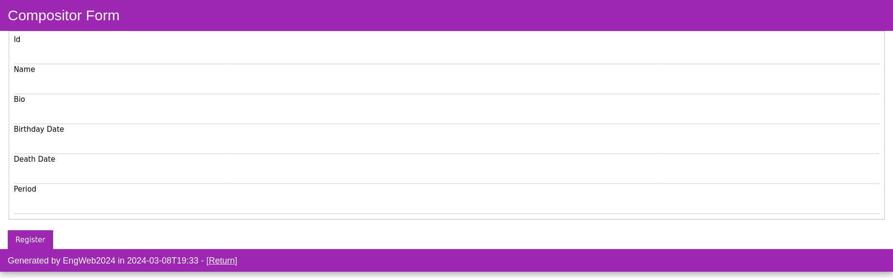

# TPC4: Compositores e os diversos Periodos - Servidor Web Para Gerenciamento

## Autor

**Nome:** João Coelho

**Número:** A100596

## Introdução

Neste trabalho o objetivo principal era o desenvolvimento de um sistema de gerenciamento de compositores e períodos musicais, desenvolvido para facilitar o armazenamento e a visualização de informações relacionadas a esses artistas e seus respectivos períodos históricos.

O sistema utiliza um servidor JSON para armazenar e fornecer os dados sobre os compositores e períodos musicais. As principais rotas para aceder esses dados são `/compositores` e `/periodos`, que retornam uma lista de todos os compositores e períodos musicais, respectivamente. Além disso, as rotas `/compositores/{id}` e `/periodos/{id}` permitem aceder informações detalhadas sobre um compositor ou período musical específico(neste último caso, ao ser selecionado um período, serão exibidos todos os compositores do mesmo).

O objetivo deste projeto é fornecer uma interface web onde os utilizadores possam visualizar, adicionar, editar e excluir informações sobre compositores e períodos musicais. O sistema deve permitir que os utilizadores naveguem pelas diferentes páginas para aceder os diversos recursos e realizar as várias operações.

## Objetivos

Assim, mais resumidamente, os objetivos do trabalho são:

- `Implementar o Dataset no JSON-Server:` Carregar os dados sobre compositores e períodos musicais num servidor JSON para fornecer acesso aos dados pela aplicação web.

- `Criação de um conjunto de rotas importantes:`
    - `/compositores:` Rota para listar todos os compositores.
    - `/compositores/{id}:` Rota para obter informações detalhadas sobre um compositor específico.
    - `/compositores?periodo={periodo}:` Rota para listar compositores de um período musical específico.
    - `/periodos:` Rota para listar todos os períodos musicais.
    - `/periodos/{id}:` Rota para obter informações detalhadas sobre um período musical específico.

- `Implementar um Serviço com Operações CRUD:` Desenvolver um serviço que ofereça operações CRUD (Create, Read, Update, Delete) para manipulação de dados sobre compositores e períodos musicais.

## Instruções de Uso

Antes de iniciar o servidor, é necessário preparar o arquivo `improved_compositores.json`, que será utilizado como dataset para o servidor JSON. Para isso, execute o seguinte comando:

```
$ python3 improveJson.py
```

Este comando irá executar o script Python `improve_dataset.py`, que melhora a estrutura do dataset original, `compositores.json`, e guarda o resultado com o nome `improved_compositores.json`. Certifique-se de que o ficheiro compositores.json esteja presente na mesma diretoria do script Python antes de executá-lo.

Antes de iniciar o servidor web, certifique-se de executar o seguinte comando para iniciar o servidor JSON que fornece os dados para a aplicação:

```
$ json-server --port 17001 --watch improved_compositores.json
```

Este comando irá iniciar o servidor JSON na porta 17001 e monitorar as alterações no ficheiro `improved_compositores.json`, que contém os dados sobre os compositores e períodos musicais.

Por fim, após preparar o dataset e iniciar o JSON-Server, pode iniciar o servidor Node.js para aceder e manipular os dados sobre compositores e períodos musicais. Para iniciar o servidor, execute o seguinte comando:

```
$ node server.js
```

Isso iniciará o servidor Node.js na porta `8080`logo, para usufruir do site criado. basta dirigir-se ao seu navegador web e colocar o seguinte endereço na barra de pesquisa:

```
http://localhost:8080
```

## Páginas do Site

A seguir estão as principais páginas da aplicação, onde os utilizadores podem realizar diferentes operações de gerenciamento de compositores e períodos musicais:

### Página Principal


Nesta página apenas está presente um pequeno índice onde o utilizador pode escolher dirigir-se para a página dos períodos ou dos compositores.

### Lista de Compositores


Página que exibe uma lista de todos os compositores, com opções para visualizar, editar, excluir e adicionar compositores.

### Detalhes do Compositor


Página que exibe informações detalhadas sobre um compositor específico.

### Páginas de CRUD



Página para registar um novo compositor.


Página para editar as informações de um compositor.

Não existe uma página para a operação de `delete`, já que basta clicar no botão da tabela apresentada na página de listagem dos compositores que o registo será logo eliminado. No entanto, existem páginas de confirmação das operações (confirmar eliminação e confirmar edição). Não serão apresentadas as páginas das operações CRUD dos períodos porque não diferem muito das que foram apresentadas nos compositores.
Embora não sejam apresentadas páginas específicas para as operações CRUD dos períodos, há outras páginas importantes relacionadas a essa seção que merecem destaque:

### Lista de Períodos


Página que exibe uma lista de todos os períodos, com opções para visualizar, editar, excluir e adicionar períodos.

### Compositores num Determinado Período


Página onde são exibidos todos os compositores pertencentes a um determinado período musical. Cada um dos nomes é um link para a página de detalhes do compositor selecionado.


